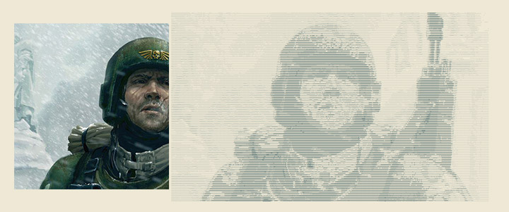

<!-- Header -->
<div align="center">
  
  <br>
  <br>
  <b>A small PHP library to generate ASCII art from images <a href="https://github.com/bylexus/img2ascii">Original Repository</a></b> 
</div>

## Installation

Install it using composer:

```
composer require bylexus/img2ascii
```

## Usage

```php
// Include the main class in your namespace:
use Img2Ascii\Processor;

$processor = new Processor('path/to/img.png');

// Default Usage: Creates a b/w ascii-art textfile with 10px per char:
$processor->asciify()->result()->writeFile('output.txt');

// If you want to have some more control over the output:
$processor
    ->asciify(5)                      // pixel width per char
    ->result('#@Mm+:-.')              // Chars to use, from darkest to lightest
    ->writeFile('filename.txt','\n'); // filename and line ending char

// If you want to define the final output width instead of
// the pixel block width, use:
$processor->asciifyToWidth(100); // Creates 100 ascii chars in width

// Love colors instead of black/white? go ahead:
$processor
    ->asciify(10)
    ->colorResult('#')                      // In color mode, only a single char is used
    ->writeFile('filename.html','<br />');  // define line ending

// Or store the Ascii result in a variable
$output = $processor
    ->asciify()
    ->result()
    ->output();
```
